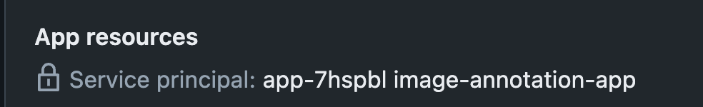
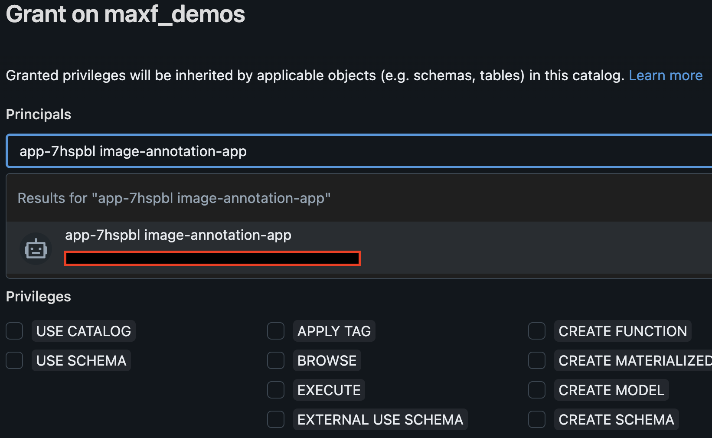
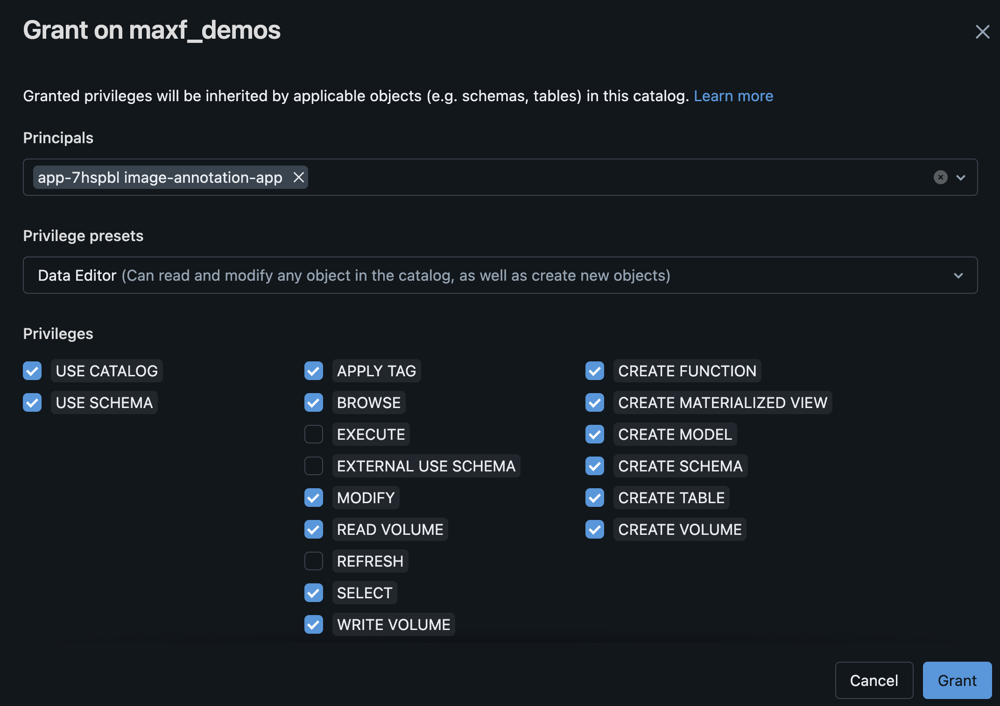

# LabelBricks  
  
Lightweight image labeling web app built-on Databricks Apps using Unity Catalog Volumes for data storage.  

All this solution encompasses is:
- Unity Catalog Volume  
- Sample Images to Review / Label  
- Databricks App for Markup / Annotation of the Images  
  
Example:  

  
## Setup
  
### Pre-requisites  
1. Databricks Account  
2. Unity Catalog  
3. Ability to create Databricks Apps  

**NOTE**: For some additional tips on getting started locally and with Databricks Apps, check out our [docs](https://docs.databricks.com/en/dev-tools/databricks-apps/get-started.html) and my other example [here](https://github.com/mpfishe2/databricks-apps-streamlit-feedback-chat-bot)  
  
## Step 0: Clone the Repository to your Local Computer  
  
1. Create and activate your virtualenv for your local environment  
2. Install the `requirements.txt` via `pip install -r requirements`  

## Step 1: Create Unity Catalog Volume  
  
1. Go to the Catalog Explorer in your Databricks Workspace and create a volume under the catalog.schema of your choice  
2. Within this volume create a directory where you will upload your images to be reviewed  
3. Upload the images from this repo (see the directory `/static/test/images/`) or your own images  

## Step 2: Create your Databricks App  

1. Go to the Compute section in the Databricks workspace and choose the "Apps" tab  
2. Create a custom app, don't choose any of the pre-selected frameworks  
3. Get the command on your App's page that looks like `databricks sync --watch`  
4. Open your cloned repo on your local computer, open terminal, and run this command to sync the code to your databricks workspace  
5. Edit your Databricks App to include two secrets `personal-access-token` and `full-databricks-host`  
- `full-databricks-host` should be something like this `https://adb-xxx.xx.azuredatabricks.net`  
- `personal-access-token` should be your personal access token value that you get from Databricks  
  
## Step 3: Give your Service Principal Access to your Volume  

1. Get your service principal name from your App's page  
  
  
  
2. Go to your Catalog in Unity Catalog an click Grant in the Permissions tab and then search for your service principal  
  
  
**NOTE**: In a real-life scenario you would scope down the permissions on this service principal, probably to the Volume level  
  
3. Give it Data Editor privilages  
  

**NOTE**: In a real-life scenario you would scope down the permissions on this service principal, probably to the Volume level  
  
## Step 4: Click Deploy in the App's Page UI  
  
1. If you have made any changes to the application, make sure you are actively running the `databricks sync --watch` command to sync to the Databricks workspace  
2. Go to your App's page and click deploy OR use `databricks apps deploy labelbricks --source-code-path /Workspace/Users/YOUR_USER_NAME/labelbricks` in your Terminal on your local computer  
3. Navigate to your app from the provided URL  