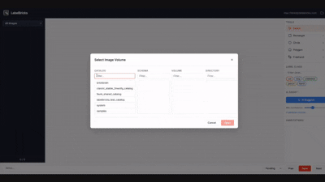

# LabelBricks

Lightweight image annotation web app built on **Databricks Apps** with **Unity Catalog Volumes** for image storage, **Lakebase** for persistent annotation metadata, and **Foundation Model APIs** for AI-assisted labeling.



## Features

- **5 annotation tools** — Select, Rectangle, Circle, Polygon, Freehand (keyboard shortcuts 1-5)
- **AI-assisted labeling** — On-demand vision model suggestions (Claude Sonnet via FMAPI) with accept/edit/reject workflow and confidence threshold filtering
- **Catalog/schema/volume browser** — Cascading picker to select any UC Volume directory as your image source
- **Persistent storage** — Lakebase (PostgreSQL) for annotations, labels, and audit history with JSON backup to Volumes
- **Label management** — Free-text label input with database-backed autocomplete and recent label chips
- **Draw-then-label UX** — Floating label popup appears after drawing, with recent label chips for fast annotation
- **Undo/Redo** — Snapshot-based history (Ctrl+Z / Ctrl+Y)
- **Image queue** — Sidebar with lazy-loaded thumbnails, status badges, and progress tracking
- **OAuth authentication** — No PATs or `.env` files required. CLI profile locally, service principal OAuth when deployed

## Tech Stack

| Layer | Technology |
|-------|------------|
| Backend | Python / Flask (Gunicorn) |
| Frontend | Vanilla JS + Fabric.js v4.6.0 (16 ES6 modules, no build step) |
| Platform | Databricks Apps |
| Image Storage | Unity Catalog Volumes |
| Annotation Storage | Lakebase Autoscaling (PostgreSQL 17) + JSON backup to Volumes |
| AI | Databricks Foundation Model APIs via `databricks-openai` |
| Auth | Databricks OAuth 2.0 / SSO |
| Deployment | Databricks Asset Bundles (`databricks.yml`) |
| Dev Tooling | `uv` for dependency management |

## Setup

### Prerequisites

1. Databricks workspace with Unity Catalog enabled
2. Ability to create Databricks Apps
3. A UC Volume with images to annotate
4. [Databricks CLI](https://docs.databricks.com/en/dev-tools/cli/install.html) installed and authenticated
5. [uv](https://docs.astral.sh/uv/) installed (or `pip`)

### Step 1: Clone and Install

```bash
git clone https://github.com/mpfishe2/labelbricks.git
cd labelbricks
uv sync
```

### Step 2: Authenticate with Databricks CLI

```bash
databricks auth login --host https://<your-workspace>.cloud.databricks.com
```

This creates a CLI profile used for local development. No `.env` file or PAT is needed.

### Step 3: Prepare a UC Volume

1. In your Databricks workspace, create a Volume under the catalog and schema of your choice
2. Upload images to the Volume (or use the samples in `static/test/images/`)

### Step 4: Run Locally

```bash
uv run python app.py
```

Open `http://localhost:5000`, select your Volume from the browser, and start annotating.

> **Tip:** If your DEFAULT CLI profile isn't pointed at the right workspace, set `DATABRICKS_CONFIG_PROFILE=<profile-name>` before running.

### Step 5: Deploy to Databricks Apps

Configure your target workspace in `databricks.yml`, then:

```bash
# Set DABs variables for your volume
databricks bundle deploy --target dev \
  --var catalog=my_catalog \
  --var schema=my_schema \
  --var volume=my_images

# Deploy the app
databricks apps deploy labelbricks-dev \
  --source-code-path /Workspace/Users/<your-email>/.bundle/labelbricks/dev/files
```

The app's service principal needs `WRITE_VOLUME` permission on your Volume, which is handled automatically by the `uc_securable` declaration in `databricks.yml`.

### Step 6 (Optional): Enable Lakebase

Lakebase provides persistent cross-session annotation storage, label autocomplete, and audit logging. Without it, annotations are stored as JSON files in the Volume.

1. **Create a Lakebase Autoscaling project** via the Databricks SDK or UI
2. **Run the bootstrap script** to set up the app service principal's database role:
   ```bash
   uv run python scripts/bootstrap_lakebase.py \
     --app-sp-client-id <SERVICE_PRINCIPAL_CLIENT_ID> \
     --endpoint projects/<project>/branches/production/endpoints/primary
   ```
3. **Add Lakebase env vars** to `app.yaml` (`PGHOST`, `PGDATABASE`, `PGUSER`, `PGPORT`, `PGSSLMODE`, `LAKEBASE_ENDPOINT`)
4. **Redeploy** — the app auto-detects Lakebase and runs schema migrations on startup

When Lakebase is configured, the app uses dual-write: Lakebase first, then JSON backup. Existing JSON annotations are automatically migrated on first volume open.

## Project Structure

```
labelbricks/
├── app.py                        # Flask application (15 routes)
├── app.yaml                      # Databricks App runtime config
├── databricks.yml                # DAB manifest (resources, targets)
├── pyproject.toml                # uv project config
├── requirements.txt              # Python dependencies
├── libraries/
│   ├── volumes.py                # UC Volume file operations
│   ├── ai_client.py              # FMAPI vision client (image -> bbox suggestions)
│   ├── db.py                     # Lakebase connection pool + OAuth token rotation
│   ├── schema.py                 # DDL for 4 tables (idempotent)
│   ├── storage.py                # LakebaseStorage CRUD
│   └── migration.py              # JSON-to-Lakebase migration
├── scripts/
│   └── bootstrap_lakebase.py     # One-time Postgres role setup
├── templates/
│   ├── index.html                # Main annotation UI (Fabric.js canvas)
│   └── set_volume.html           # Landing page
├── static/
│   ├── style.css                 # Databricks-aligned design system
│   └── js/                       # 16 ES6 modules
│       ├── app.js                # Entry point (LabelBricksApp orchestrator)
│       ├── api-client.js         # Backend API wrapper
│       ├── canvas-manager.js     # Fabric.js canvas lifecycle
│       ├── tool-manager.js       # Tool state machine + shortcuts
│       ├── annotation-store.js   # In-memory annotation model
│       ├── label-manager.js      # Label input + autocomplete
│       ├── label-popup.js        # Post-draw labeling popup
│       ├── sidebar.js            # Image queue + thumbnails
│       ├── volume-browser.js     # Catalog/schema/volume modal
│       ├── undo-manager.js       # Undo/redo (Ctrl+Z/Y)
│       ├── ai-suggest.js         # AI suggestion lifecycle
│       └── tools/                # Select, Rectangle, Circle, Polygon, Freehand
└── .claude/                      # Claude Code config
```

## How It Works

1. **Select a Volume** — The catalog/schema/volume browser lets you pick any UC Volume directory containing images
2. **Browse images** — The sidebar shows thumbnails with status badges (pending/reviewed/done)
3. **Annotate** — Use rectangle, circle, polygon, or freehand tools to draw bounding boxes and regions. A label popup appears after each annotation for labeling
4. **AI Suggest** — Click the AI Suggest button to get vision model predictions rendered as dashed blue overlays. Accept, edit, or reject each suggestion
5. **Save** — Annotations are saved to Lakebase (if configured) and as JSON to the Volume. Composite overlay PNGs are also generated

## Resources

- [Databricks Apps Documentation](https://docs.databricks.com/en/dev-tools/databricks-apps/index.html)
- [Databricks Apps Cookbook](https://apps-cookbook.dev/docs/intro)
- [Unity Catalog Volumes](https://docs.databricks.com/en/connect/unity-catalog/volumes.html)
- [Lakebase](https://docs.databricks.com/en/lakebase/index.html)
- [Foundation Model APIs](https://docs.databricks.com/en/machine-learning/model-serving/score-foundation-models.html)
